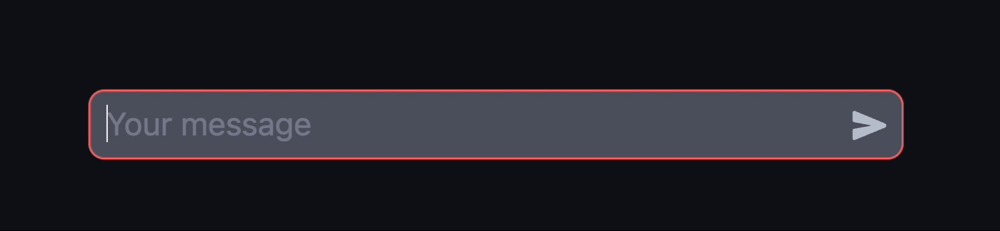
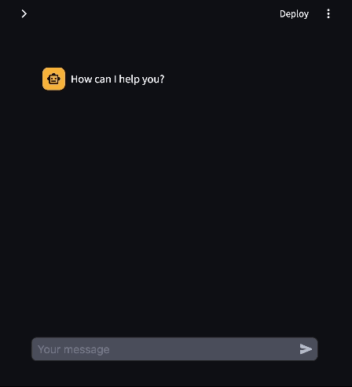

## Modifications from Kernware
* Add suggestions/preset history
* allow keydown to clear the current selection
* remove local JS history, as we use it after rerun, so history will be empty
* small UI changes, fixing colors, border width...

# streamlit-chat-input-advanced

Streamlit component that allows you catch arrow up keyboard event

it implements ability to 
* clear textarea when user press Escape

  
* allow go back and forth by message history 

    

## Installation instructions

```sh
pip install streamlit-chat-input-advanced
```

## Usage instructions

```python
import streamlit as st

from chat_input_advanced import chat_input_avd

value = chat_input_avd()

st.write(value)
```

## Release Process

Build package:
```
npm --prefix ./chat_input_advanced/frontend run build
```

Create new branch with version
```
git checkout -b "v<version>"
```

Force add build folder and push
```
git add -f chat_input_advanced/frontend/build/
git commit -m "Release v<version>"
git push --set-upstream origin v<version>
```

And then create a new release on github, create a new tag with `release_v<version>`
